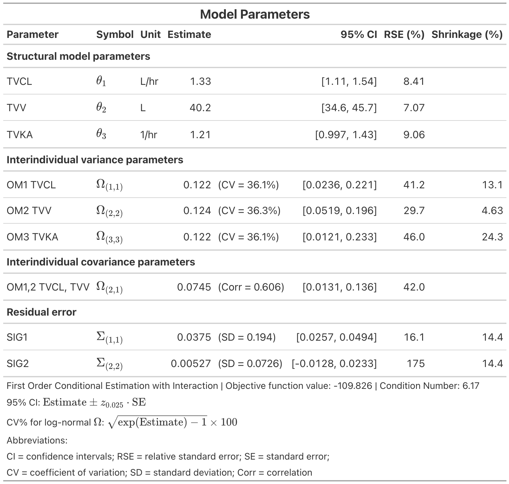
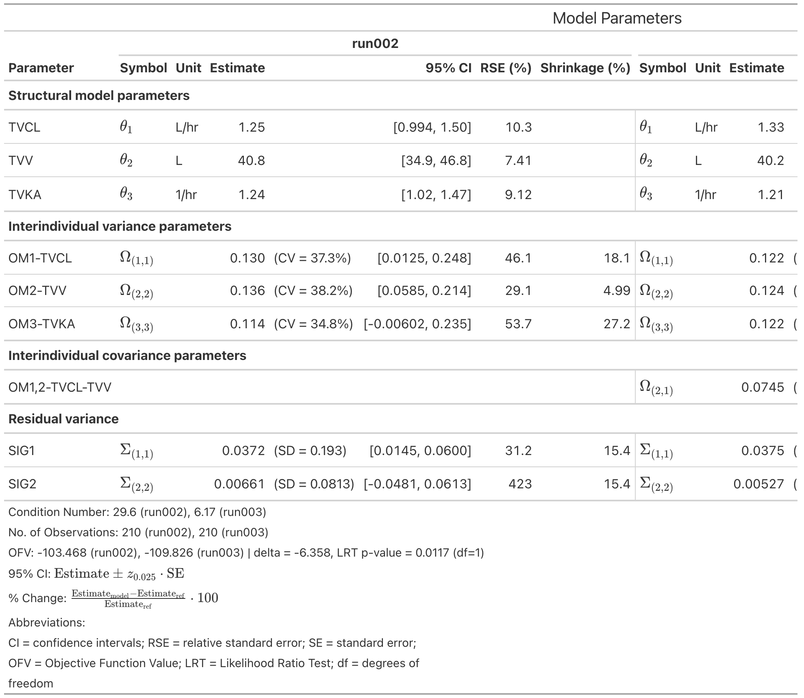
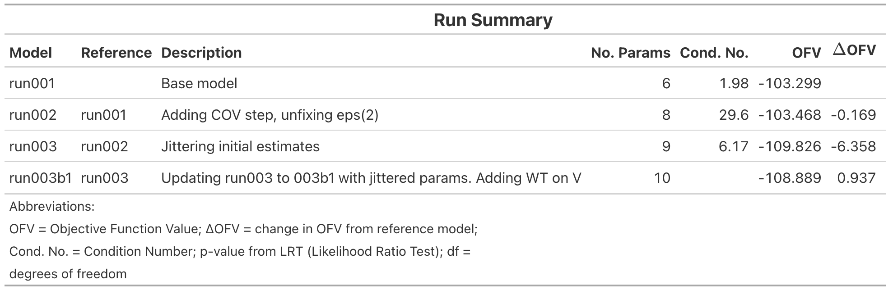

<!-- README.md is generated from README.Rmd. Please edit that file -->

# hyperion.tables

<!-- badges: start -->

[](https://github.com/A2-ai/hyperion.tables/actions/workflows/R-CMD-check.yaml)
<!-- badges: end -->

Flexible tables for hyperion models.

## Installation

You can install the development version of hyperion.tables from
[GitHub](https://github.com/) with:

``` r
# install.packages("pak")
pak::pak("A2-ai/hyperion.tables")
```

``` r
library(gt)
library(hyperion)
#> 
#> 
#> ── pharos configuration ────────────────────────────────────────────────────────
#> ✔ pharos.toml found: /Users/mattsmith/Documents/hyperion.tables/pharos.toml
#> ── hyperion options ────────────────────────────────────────────────────────────
#> ✔ hyperion.significant_number_display : 4
#> ── hyperion nonmem object options ──────────────────────────────────────────────
#> ✔ hyperion.nonmem_model.show_included_columns : FALSE
#> ✔ hyperion.nonmem_summary.rse_threshold : 50
#> ✔ hyperion.nonmem_summary.shrinkage_threshold : 30
library(hyperion.tables)
```

## Example

### Parameter table

``` r
model_dir <- system.file("extdata", "models", "onecmt",  package = "hyperion.tables")
spec <- TableSpec(
  display_transforms = list(omega = c("cv")),
  sections = section_rules(
    kind == "THETA" ~ "Structural model parameters",
    kind == "OMEGA" & diagonal ~ "Interindividual variance parameters",
    kind == "OMEGA" & !diagonal ~ "Interindividual covariance parameters",
    kind == "SIGMA" ~ "Residual error",
    TRUE ~ "Other"
  ),
  parameter_names = ParameterNameOptions(source = "display"),
  title = "Model Parameters"
)

model <- read_model(file.path(model_dir, "run003.mod"))
params <- get_parameters(model)
info <- get_model_parameter_info(model)
mod_sum <- summary(model)

param_gt <- params |>
  apply_table_spec(spec, info) |>
  add_summary_info(mod_sum) |>
  make_parameter_table()
```



### Comparison table

``` r
model_dir <- system.file("extdata", "models", "onecmt", package = "hyperion.tables")

spec <- TableSpec(
  display_transforms = list(omega = c("cv")),
  sections = section_rules(
    kind == "THETA" ~ "Structural model parameters",
    kind == "OMEGA" & diagonal ~ "Interindividual variance parameters",
    kind == "OMEGA" & !diagonal ~ "Interindividual covariance parameters",
    kind == "SIGMA" ~ "Residual variance",
    TRUE ~ "Other"
  ),
  drop_columns = c("variability", "rse", "shrinkage")
)

run002 <- read_model(file.path(model_dir, "run002.mod"))
run003 <- read_model(file.path(model_dir, "run003.mod"))

comp_gt <- get_parameters(run002) |>
  apply_table_spec(spec, get_model_parameter_info(run002)) |>
  add_summary_info(summary(run002)) |>
  compare_with(
    get_parameters(run003) |>
      apply_table_spec(spec, get_model_parameter_info(run003)) |>
      add_summary_info(summary(run003)),
    labels = c("run002", "run003")
  ) |>
  add_model_lineage(get_model_lineage(run002)) |>
  make_comparison_table()
```



### Summary table

``` r
model_dir <- system.file("extdata", "models", "onecmt", package = "hyperion.tables")
tree <- get_model_lineage(model_dir)

summary_gt <- tree |>
  apply_summary_spec(SummarySpec()) |>
  make_summary_table()
```



### Custom renderers

`make_parameter_table(output = "data")` returns a `HyperionTable`. If
you need custom output, call `apply_formatting()` and render the
returned data frame with your preferred table package.

``` r
htable <- params |>
  apply_table_spec(spec, info) |>
  add_summary_info(mod_sum) |>
  make_parameter_table(output = "data")

data <- apply_formatting(htable)
# render data with your custom table tool
```
